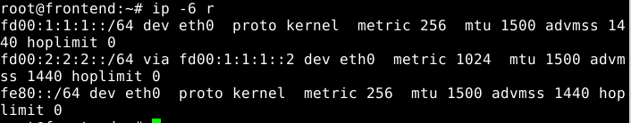

# ASOR - Febrero 2014 - Práctica

*********************** **Ejercicio 1** ***********************

*VM1:*
<pre>
<code>$ip link set eth0 up
$ip a add fd00:1:1:1::1/64 dev eth0
</code></pre>

*ROUTER:*
<pre>
<code>$ip link set eth0 up
$ip a add fd00:1:1:1::2/64 dev eth0
</code></pre>

Comando usado para verificar la configuración de la red:

*VM1:*
<pre>
<code>$ping6 -c 2 fd00:1:1:1::2
</code></pre>

*********************** **Ejercicio 2** ***********************

*ROUTER:*
<pre>
<code>$ip link set eth1 up
$ip a add fd00:2:2:2::1/64 dev eth1
$nano /etc/quagga/daemons
****************************************
zebra=yes
****************************************
nano /etc/quagga/zebra.conf
****************************************
interface eth1
        no ipv6 nd suppress-ra
        ipv6 nd prefix fd00:2:2:2::/64
****************************************
service quagga start
</code></pre>

*VM2:*
<pre>
<code>$ip link set eth0 up
$ping
</code></pre>

*ROUTER:*
<pre>
<code>$ping6  fd00:2:2:2:a00:27ff:fe98:e3ab
</code></pre>

Dirección asginada a VM2:

fd00:2:2:2:a00:27ff:fe98:e3ab/64

*********************** **Ejercicio 3** ***********************

*VM1:*
<pre>
<code>$ip -6 r add fd00:2:2:2::/64 via fd00:1:1:1::2
</code></pre>

*VM2:*
<pre>
<code>$ip -6 r add fd00:1:1:1::/64 via fd00:2:2:2::1
</code></pre>

*ROUTER:*
<pre>
<code>$sysctl -w net.ipv6.conf.all.forwarding=1
</code></pre>

*VM1:*
<pre>
<code>$ping6  fd00:2:2:2:a00:27ff:fe98:e3ab
</code></pre>

Esccriba la tabla de rutas de VM1 y el comando usado.

*********************** **Ejercicio 4** ***********************

[ej4](ej4.c)

*********************** **Ejercicio 5** ***********************

[ej4](ej5.c)

*********************** **Ejercicio 6** ***********************

[ej4](ej6.c)

*********************** **Ejercicio 7** ***********************

[ej4](ej7.c)
