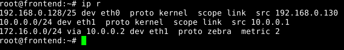
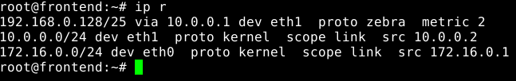

# ASOR - Febrero 2016 - Práctica

*********************** **Ejercicio 1** ***********************

*VM1:*
<pre>
<code>$ip link set eth0 up
$ip a add 192.168.0.129/25 dev eth0
</code></pre>

*Router1:*
<pre>
<code>$ip link set eth0 up
$ip link set eth1 up
$ip a add 192.168.0.130/25 dev eth0
$ip a add 10.0.0.1/24 dev eth1
</code></pre>

*Router2:*
<pre>
<code>$ip link set eth0 up
$ip link set eth1 up
$ip a add 10.0.0.2/24 dev eth1
$ip a add 172.16.0.1/24 dev eth0
</code></pre>

*VM1:*
<pre>
<code>$ping 192.168.0.130
</code></pre>

*Router1:*
<pre>
<code>$ping 10.0.0.2
</code></pre>

*********************** **Ejercicio 2** ***********************

*Router1 y Router2:*
<pre>
<code>$nano /etc/quagga/daemons
********************************
zebra=yes
ripd=yes
********************************
$touch /etc/quagga/zebra.conf
</code></pre>

*Router1 y Router2:*
<pre>
<code>$nano /etc/quagga/ripd.conf
********************************
router rip
version 2
network eth0
network eth1
********************************
$service quagga start
</code></pre>

*Router1 y Router2:*
<pre>
<code>$ip r
</code></pre>

