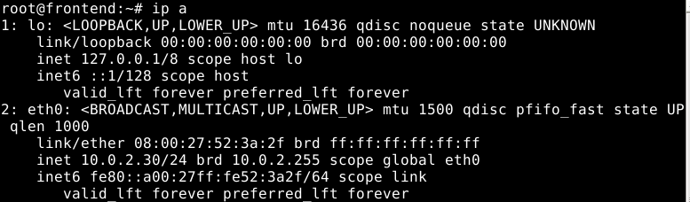

# ASOR - Febrero 2017 - Práctica

*********************** **Ejercicio 1** ***********************

*VM1:*
<pre>
<code>$ip link set eth0 up
$ip a add 192.168.0.129/25 dev eth0
</code></pre>

*VM2:*
<pre>
<code>$ip link set eth0 up
$ip a add 10.0.2.2/24 dev eth0
</code></pre>

*Router:*
<pre>
<code>$ip link set eth0 up
$ip link set eth1 up
$ip a add 192.168.0.130/25 dev eth0
$ip a add 10.0.2.1/24 dev eth1
</code></pre>

*VM1:*
<pre>
<code>$ping 192.168.0.130
</code></pre>

*VM2:*
<pre>
<code>$ping 10.0.2.1
</code></pre>

*********************** **Ejercicio 2** ***********************

*Router:*
<pre>
<code>$nano /etc/dhcp/dhcpd.conf
******************************
subnet 10.0.2.0 netmask 255.255.255.0 {
  range 10.0.2.30 10.0.2.50;
  option routers 10.0.2.1;
  option broadcast-address 10.0.2.255;
}
******************************
service isc-dhcp-server start
</code></pre>

*VM2:*
<pre>
<code>$dhclient -d eth0
</code></pre>

*VM2:*
<pre>
<code>$ip a
</code></pre>

*********************** **Ejercicio 3** ***********************

[ej3](ej3.c)

*********************** **Ejercicio 4** ***********************

[ej4](ej4.c)
