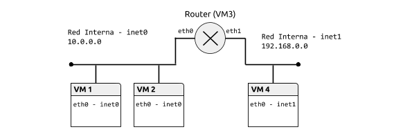
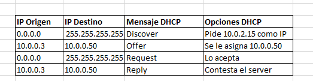

# Práctica 1.1.Protocolo IPv4. Servicio DHCP

## Tabla de contenido
- [Topología](#topología).
- [Configuración Estática](#configuración-estática).
- [Encaminamiento estático](#encaminamiento-estático).
- [Configuración Dinámica de Hosts](#configuración-dinámica-de-hosts).

### Topología

### Configuración Estática
*********************** **Ejercicio 1** ***********************

*VM1:*
<pre>
<code>$ip address
$ip link show
</code></pre>

Resultado:
<pre><code>1: lo: <LOOPBACK,UP,LOWER_UP> mtu 16436 qdisc noqueue state UNKNOWN
link/loopback 00:00:00:00:00:00 brd 00:00:00:00:00:00
2: eth0: <BROADCAST,MULTICAST,UP,LOWER_UP> mtu 1500 qdisc pfifo_fast state UP qlen 1000
link/ether 08:00:27:cb:50:0b brd ff:ff:ff:ff:ff:f
</code></pre>

*********************** **Ejercicio 2** ***********************

*VM1:*
<pre>
<code>$ip link set eth0 up
$ip a add 10.0.0.1/24 dev eth0
</code></pre>
*VM2:*
<pre>
<code>$ip link set eth0 up
$ip a add 10.0.0.2/24 dev eth0
</code></pre>
*VM3:*
<pre>
<code>$ip link set eth0 up
$ip link set eth1 up
$ip a add 10.0.0.3/24 dev eth0
$ip a add 192.168.0.2/24 dev eth1
</code></pre>
*VM4:*
<pre>
<code>$ip link set eth0 up
$ip a add 192.168.0.1/24 dev eth0
</code></pre>

*********************** **Ejercicio 3** ***********************
<pre>
<code>$ping 10.0.0.2 -c 2
</code></pre>

Resultado:

*********************** **Ejercicio 4** ***********************

*VM1:*
<pre>
<code>$ip neigh
$ip ping -c 1 10.0.0.2
</code></pre>

Resultado:
<pre><code>10.0.0.3 dev eth0 lladdr 08:00:27:77:3d:57 STALE
10.0.0.2 dev eth0 lladdr 08:00:27:5d:96:b6 REACHABLE

Reachable:
    the neighbour entry is valid until the reachability timeout expires.
Stale:
    the neighbour entry is valid but suspicious. This option to ip neigh does not change the neighbour state if it was valid and the address is not changed by this command.

</code></pre>

*********************** **Ejercicio 5** ***********************

*VM1:*
<pre>
<code>$ip ping -c 1 192.168.0.1
</code></pre>

Resultado:
<pre><code>From 10.0.0.3 icmp_seq=2 Destination Net Unreachable
</code></pre>

### Encaminamiento Estático

*********************** **Ejercicio 1** ***********************

*VM3:*
<pre>
<code>$sysctl net.ipv4.ip_forward=1
</code></pre>

*********************** **Ejercicio 2** ***********************

*VM1:*
<pre>
<code>$ip route add default via 10.0.0.3
</code></pre>

*VM2:*
<pre>
<code>$ip route add default via 10.0.0.3
</code></pre>

*********************** **Ejercicio 3** ***********************

*VM4:*
<pre>
<code>$ip route add 10.0.0.1 via 192.168.0.2 dev eth0
$ping -c 10.0.0.1
</code></pre>

*********************** **Ejercicio 4** ***********************

*VM4:*
<pre>
<code>$ping 10.0.0.1 -c 2
</code></pre>

Resultado:

Red 10.0.0.0/24 - VM1

Red 192.168.0.0/24 - VM1

### Configuración Dinámica de Hosts

*********************** **Ejercicio 1** ***********************

*VM1:*
<pre>
<code>$ip a del 10.0.0.1/24 dev eth0
</code></pre>
*VM2:*
<pre>
<code>$ip a del 10.0.0.2/24 dev eth0
</code></pre>
*VM4:*
<pre>
<code>$ip a del 192.168.0.1/24 dev eth0
</code></pre>

*********************** **Ejercicio 2** ***********************

*VM3:*
<pre>
<code>$nano /etc/dhcp/dhcpd.conf

***********************************************************
subnet 10.0.0.0 netmask 255.255.255.0 {
  range 10.0.0.11 10.0.0.50;
  option routers 10.0.0.3;
  option broadcast-address 10.0.0.255;
}

subnet 192.168.0.0 netmask 255.255.255.0 {
  range 192.168.0.6 192.168.0.9;
  option routers 192.168.0.2;
  option broadcast-address 192.168.0.255;
}
***********************************************************
$service isc-dhcp-server start
</code></pre>

*********************** **Ejercicio 3** ***********************

*VM1:*
<pre>
<code>$dhclient -d eth0
</code></pre>

Resultado:

*********************** **Ejercicio 4** ***********************
Resultado:
<pre>
<code>El request se hace del Router 3 al Host (VM1) sirve para comprobar que la ip ofertada está en la misma red.
</code></pre>

*********************** **Ejercicio 5** ***********************

*VM4:*
<pre>
<code>$nano etc/network/interfaces
***********************************************************
auto eth0
allow-hotplug eth0
iface eth0 inet dhcp
***********************************************************
</code></pre>

*********************** **Ejercicio 5** *********************** 

*VM4:*
<pre>
<code>$ifup eth0
$ifdown eth0
</code></pre>
