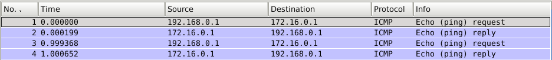
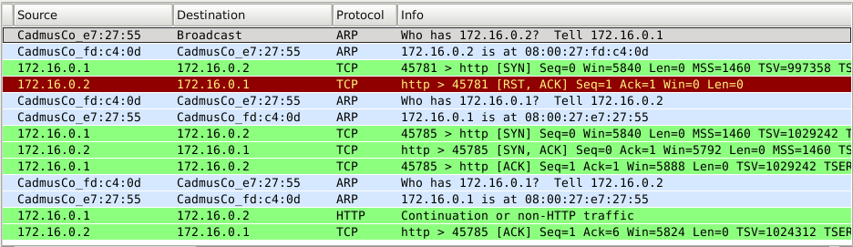

# Práctica 1.1.Protocolo IPv4. Servicio DHCP

## Tabla de contenido
- [Topología](#topología).
- [Preparación del entorno para la práctica](#preparación-del-entorno-para-la-practica).
- [Estados de una conexión TCP](#estados-de-una-conexión-tcp).
- [Introducción a la seguridad del protocolo TCP](#introducción-a-la-seguridad-del-protocolo-TCP).
- [Opciones y parámetros TCP](#Opciones-y-parámetros-TCP).
- [Traducción de direcciones NAT y reenvío de puerto: port forwarding](#Traducción-de-direcciones-NAT-y-reenvío-de-puerto:-port-forwarding).

### Topología

## Preparación del entorno para la práctica

*VM1:*
<pre>
<code>$ip link set eth0 up
$ip a add 192.168.0.1/24 dev eth0
$ip route add default via 192.168.0.3
$ping -c 1 172.16.0.1
</code></pre>
*VM2:*
<pre>
<code>$ip link set eth0 up
$ip a add 192.168.0.2/24 dev eth0
$ip route add default via 192.168.0.3
</code></pre>
*VM3:*
<pre>
<code>$ip link set eth0 up
$ip link set eth1 up
$ip a add 192.168.0.3/24 dev eth0
$ip a add 172.16.0.2/24 dev eth1
$sysctl net.ipv4.ip_forward=1
</code></pre>
*VM4:*
<pre>
<code>$ip link set eth0 up
$ip a add 172.16.0.1/24 dev eth0
$ip route add default via 172.16.0.2
</code></pre>

### Estados de una conexión TCP

*********************** **Ejercicio 1** ***********************
**->Netcat**
Network swiss army knife
**->Netstat**
Print network connections, routing tables, interface statis-tics, masquerade connections, and multicast memberships

*********************** **Ejercicio 2** ***********************
*VM1:*
<pre>
<code>$nc -l -p 7777
$netstat -l
</code></pre>

Resultado:
<pre>
<code>tcp 0 *:7777 *:* LISTEN     
tcp6 0 0 [::]:7777 [::]:* LISTEN
</code></pre>

*********************** **Ejercicio 3** ***********************
a)

*VM1:*
<pre>
<code>$nc -l -s localhost -p 7777
</code></pre>

*VM1:*
<pre>
<code>$nc localhost 7777
</code></pre>

Resultado:
<pre>
<code>tcp 0 0 localhost:57991 localhost:7777  ESTABLISHED
tcp 0 0 localhost:7777  localhost:57991 ESTABLISHED
</code></pre>

b)
*VM2:*
<pre>
<code>$nc 192.168.0.1 7777
</code></pre>

*VM1:*
<pre>
<code>$netstat | grep 7777
</code></pre>

Resultado:
<pre>
<code>tcp 0 0 192.168.0.1:7777 192.168.0.2:60988 ESTABLISHED
</code></pre>

*********************** **Ejercicio 4** ***********************

*VM1:*
<pre>
<code>CTR+C
$netstat -o | grep 7777
</code></pre>

Resultado:
<pre>
<code>tcp 0 0 192.168.0.1:7777 192.168.0.2:60996 TIME_WAIT
timewait (58,64/0/
</code></pre>

*********************** **Ejercicio 5** ***********************

a)
*VM1:*
No dejar salir ninguna conexión con los Flags ACK o SYN activados.
<pre>
<code>$iptables -A OUTPUT -p tcp --dport 7777 --tcp-flags ALL ACK,SYN -j DROP
$iptables -L
$nc -l -p 7777
</code></pre>

*VM1: (Otra alternativa)*
<pre>
<code>$iptables -A INPUT -p tcp --dport 7777 -m state --state NEW -j DROP -- VM1
$nc -l -p 7777
</code></pre>

*VM2:*
<pre>
<code>$nc 192.168.0.1 7777
$netstat | grep 7777
</code></pre>

Resultado (VM2):
<pre>
<code>tcp 0 1 192.168.0.2:60993 192.168.0.1:7777 SYN_SENT  
</code></pre>

b)
*VM1:*
<pre>
<code>$iptables -F
$iptables -L
$nc -l -p 7777
</code></pre>

*VM2:*
No dejar que entre ninguna conexión con el flag ACK activado.
<pre>
<code>$iptables -A OUTPUT -p tcp --dport 7777 --tcp-flags ALL ACK -j DROP
$netstat | grep 7777
</code></pre>

*VM1:*
<pre>
<code>$netstat | grep 7777
</code></pre>

Resultado:
<pre>
<code>tcp 0 0 192.168.0.1:7777 192.168.0.2:60995 SYN_RECV  
</code></pre>

*VM2:*
<pre>
<code>CTR+C
</code></pre>

*VM1:*
<pre>
<code>$netstat | grep 7777
</code></pre>

Resultado:
<pre>
<code>tcp 0 1 192.168.0.1:7777 192.168.0.2:60995 LAST_ACK  
</code></pre>

*********************** **Ejercicio 6** ***********************
*VM2:*
<pre>
<code>$nc 192.168.0.1 7778
</code></pre>

Resultado:

### Introducción a la seguridad del protocolo TCP

*********************** **Ejercicio 1** ***********************
*VM2:*
<pre>
<code>$hping3 --flood --rand-source -p 23 --syn 192.168.0.1
</code></pre>

*VM1:*
<pre>
<code>$telnet localhost
</code></pre>

Resultado:
<pre>
<code>Trying 127.0.0.1...
telnet: Unable to connect to remote host: Connection timed out
</code></pre>

*VM1:*
<pre>
<code>$sysctl net.ipv4.tcp_syncookies=1
</code></pre>

*VM2:*
<pre>
<code>$hping3 --flood --rand-source -p 23 --syn 192.168.0.1
</code></pre>

*VM1:*
<pre>
<code>$telnet localhost
</code></pre>

Resultado:
<pre>
<code>Ya nos podemos conectar por Telnet.
</code></pre>

*********************** **Ejercicio 1** ***********************
*VM1:*
<pre>
<code>$nc -l -p 7777
</code></pre>

*VM2:*
<pre>
<code>$nc -l -p 7777
root@frontend:~# nc -z -v 192.168.0.1 7775
nc: inverse lookup failed for 192.168.0.1: Fallo temporal en la resolución del nombre
nc: cannot connect to 192.168.0.1 7775: Conexión rehusada
nc: unable to connect to address 192.168.0.1, service 7775
root@frontend:~# nc -z -v 192.168.0.1 7776
nc: inverse lookup failed for 192.168.0.1: Fallo temporal en la resolución del nombre
nc: cannot connect to 192.168.0.1 7776: Conexión rehusada
nc: unable to connect to address 192.168.0.1, service 7776
root@frontend:~# nc -z -v 192.168.0.1 7777
nc: inverse lookup failed for 192.168.0.1: Fallo temporal en la resolución del nombre
nc: 192.168.0.1 7777 open
</code></pre>

### Opciones y parámetros TCP

*********************** **Ejercicio 1** ***********************

**Escalado de la ventana** (net.ipv4.tcp_window_scaling=1): Permite aumentar el tamaño de la RW a mas de 64K, algo necesario para altas velocidades de transmision con alta latencia.
**Marcas de tiempo** (net.ipv4.tcp_timestamps=1): Sirven para ayudar a TCP a determinar en que orden se enviaron los paquetes.
**ACKs Selectivos** (net.ipv4.tcp_sack=1): Sirve para activar los SACK: Selective-ACK confirman segmentos fuera de orden, no reemplazan los ACK y son implementados como opción ACK.

*********************** **Ejercicio 2** ***********************

*VM1:*
<pre>
<code>$sysctl -w net.ipv4.tcp_sack = 0
</code></pre>

*********************** **Ejercicio 3** ***********************

**net.ipv4.tcp_keepalive_time=7200** : Tiempo necesario (en silencio) para revisar si una conexion sigue viva.
**net.ipv4.tcp_keepalive_probes=9** : Numero de pruebas tras el tiempo anterior superado, para ver si sigue viva la conexión.
**net.ipv4.tcp_keepalive_time=75** : Intervalo entre pruebas.

### Traducción de direcciones NAT y reenvío de puerto: port forwarding

a)

*VM1:*
<pre>
<code>$ing 172.16.0.1 -I eth0
</code></pre>

*VM1:*
<pre>
<code>$ping 172.16.0.1 -I eth0
</code></pre>

*VM3:*
<pre>
<code>$iptables -t nat -A POSTROUTING -o eth1 -j MASQUERADE
</code></pre>

Resultado:
<pre>
<code>Como podemos observar en la última parte, en eth1 sólo usa la IP pública que al ser dinámica y guardar la pista de las conexiones activas es capaz de cambiar a la IP privada.
</code></pre>

b)
*VM1:*
<pre>
<code>$nc -4 -l -p 7777
</code></pre>

*VM3:*
<pre>
<code>$iptables  -t nat -F
$iptables -t nat -A PREROUTING -d 172.16.0.2 -p tcp --dport 80 -j DNAT --to 192.168.0.1:7777
</code></pre>

*VM4:*
<pre>
<code>$nc 172.16.0.2 80
</code></pre>

Resultado (Red pública: 172.16.0.0):

<pre>
<code> VM4 se está conectando por el puerto 80 a la máquina VM3 (Router)
</code></pre>

Resultado (Red privada: 192.168.0.0):

<pre>
<code> VM3 (Router) reedirige la conexión del puerto 80 al puerto 7777 para conectarse con VM1
</code></pre>
