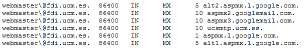
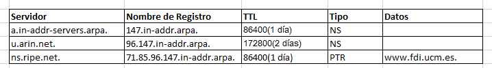

# Práctica 1.3.Domain Name System (DNS)

## Tabla de contenido
- [Topología](#topología).
- [Preparación del entorno para la práctica](#preparación-del-entorno-para-la-práctica).
- [Cliente DNS](#cliente-dns).
- [Servidor DNS](#servidor-dns).
  - [Zona Directa Forward](#zona-directa-forward).
  - [Zona Inversa Inverse](#zona-inversa-inverse).

### Topología

### Preparación del entorno para la práctica

*VM1:*
<pre>
<code>$ip link set eth0 up
$ip a add 192.168.0.1/24 dev eth0
</code></pre>
*VM2:*
<pre>
<code>$ip link set eth0 up
$ip a add 192.168.0.100/24 dev eth0
</code></pre>

### Cliente DNS

*********************** **Ejercicio 1** ***********************

*VM1:*
<pre>
<code>$man resolv.conf
</code></pre>

**->resolv.conf**
Sirve para proporcionar acceso al Sistema de Nombres de Dominio (DNS) de internet.

**->nameserver**
Dirección Internet, en notación en punto, de un servidor de un servidor de nombre.

**->search**
Lista de búsquedas de nombres de host determinada por el nombre de dominio loca.

*********************** **Ejercicio 2** ***********************

Desde la Página: http://www.digwebinterface.com/

*PASO 1:*
<pre>
<code>Hostname or Ip addresses: informatica.ucm.es.
Type: A
Options: Show Command
Nameservers (Specify myself): a.root-servers.net
</code></pre>

Nos dice que el TLD está en g.nic.es.

*PASO 2:*
<pre>
<code>Hostname or Ip addresses: informatica.ucm.es
Type: A
Options: Show Command
Nameservers (Specify myself): a.nic.es.
</code></pre>

Nos dice que ucm.es. se encuentra en  crispin.sim.ucm.es.

*PASO 3:*
<pre>
<code>Hostname or Ip addresses: informatica.ucm.es
Type: A
Options: Show Command
Nameservers (Specify myself): crispin.sim.ucm.es.
</code></pre>

Aquí ya hemos recorido el árbol de subdominios, y observamos que la URL introducida es un alias de ucm.es.

Resultado:
<pre>
<code> informatica.ucm.es.	86400	IN	CNAME	ucm.es.
ucm.es.			86400	IN	A	147.96.1.15
</code></pre>

*********************** **Ejercicio 3** ***********************

Desde la Página: http://www.digwebinterface.com/

<pre>
<code>Hostname or Ip addresses: informatica.ucm.es
Type: SOA
Options: Show Command
Nameservers (Specify myself): crispin.sim.ucm.es.
</code></pre>

Resultado:

*********************** **Ejercicio 4** ***********************

Desde la Página: http://www.digwebinterface.com/

<pre>
<code>Hostname or Ip addresses: webmaster@fdi.ucm.es.
Type: MX
Options: Show Command
Nameservers (Specify myself): crispin.sim.ucm.es.
</code></pre>

Resultado:

*********************** **Ejercicio 5** ***********************

Desde la Página: http://www.digwebinterface.com/

*PASO 1:*
<pre>
<code>Hostname or Ip addresses: 71.85.96.147.in-addr.arpa.
Type: PTR
Options: Show Command
Nameservers (Specify myself): a.in-addr-servers.arpa.
</code></pre>

*PASO 2:*
<pre>
<code>Hostname or Ip addresses: 71.85.96.147.in-addr.arpa.
Type: PTR
Options: Show Command
Nameservers (Specify myself): u.arin.net.
</code></pre>

*PASO 3:*
<pre>
<code>Hostname or Ip addresses: 71.85.96.147.in-addr.arpa.
Type: PTR
Options: Show Command
Nameservers (Specify myself): ns.ripe.net.
</code></pre>

Resultado:
<pre>
<code> 71.85.96.147.in-addr.arpa. 86400 IN	PTR	www.fdi.ucm.es.
</code></pre>

*********************** **Ejercicio 6** ***********************

Desde la Página: http://www.digwebinterface.com/

<pre>
<code>Hostname or Ip addresses: www.google.com
Options: Show Command && Trace
Nameservers (Resolver): Default
</code></pre>

Resultadado:
<pre>
<code>www.google.com está en:  172.217.4.228
</code></pre>

### Servidor DNS

### Zona Directa Forward

*********************** **Ejercicio 1** ***********************

*VM1:*
<pre>
<code>$nano /etc/bind/named.conf
***************************************
//include "/etc/bind/named.conf.options";
//include "/etc/bind/named.conf.local";
//include "/etc/bind/named.conf.default-zones";

zone "labfdi.es" {
  type master;
  file "/etc/bind/db.labfdi.es";
};
***************************************
$named-checkconf
</code></pre>

*********************** **Ejercicio 2** ***********************

*VM1:*
<pre>
<code>$nano /etc/bind/db.labfdi.es
***************************************
$TTL    2d
labfdi.es.      IN      SOA     ns.labfdi.es. hostmaster.labfdi.es. (
                        2003004         ; Serial
                             3h         ; Refresh
                            14M         ; Retry
                          3W12h         ; Expire
                          2h20M         ; Negative Cacha TTL
                          )
                IN      NS      ns.labfdi.es.
ns.labfdi.es.   IN      A       192.168.0.1
www.labfdi.es.  IN      A       192.168.0.200
www.labfdi.es.  IN      AAAA    fd00::1
                IN      MX      10      mail.labfdi.es.
mail.labfdi.es. IN      A       192.168.0.250
ser.labfdi.es.   IN      CNAME   mail.labfdi.es.

***************************************
$named-checkzone labfdi.es. /etc/bind/db.labfdi.es
</code></pre>

*********************** **Ejercicio 3** ***********************

*VM1:*
<pre>
<code>$sudo service bind9 start
</code></pre>

*********************** **Ejercicio 4** ***********************

*VM2:*
<pre>
<code>$sudo nano /etc/resolv.conf
***************************************
domain ns.labfdi.es
search ns.labfdi.es
nameserver 192.168.0.1
***************************************
$dig  www.labfdi.es
</code></pre>

*********************** **Ejercicio 5** ***********************

*VM2:*
<pre>
$dig  www.labfdi.es
$dig labfdi.es.
$dig ser.labfdi.es.
</code></pre>

*********************** **Ejercicio 6** ***********************

*VM2:*
<pre>
$dig  www.labfdi.es
</code></pre>

### Zona Inversa Inverse

*********************** **Ejercicio 1** ***********************

*VM1:*
<pre>
<code>$nano /etc/bind/named.conf
***************************************
//include "/etc/bind/named.conf.options";
//include "/etc/bind/named.conf.local";
//include "/etc/bind/named.conf.default-zones";

zone "labfdi.es" {
  type master;
  file "/etc/bind/db.labfdi.es";
};

zone "0.168.192.in-addr.arpa." {
  type master;
  file "/etc/bind/0.168.192.db";
};
***************************************
$named-checkconf /etc/bind/named.conf
</code></pre>

*********************** **Ejercicio 2** ***********************

*VM1:*
<pre>
<code>$nano /etc/bind/db.0.168.192
***************************************
$TTL    604800
0.168.192.in-addr.arpa. IN SOA ns.labfdi.es. hostmaster.labfdi.es. (
                              2         ; Serial
                         604800         ; Refresh
                          86400         ; Retry
                        2419200         ; Expire
                         604800 )       ; Negative Cache TTL
;
@                     IN      NS      ns.labfdi.es.
@                     IN      PTR     ns.labfdi.es.
1                     IN      PTR     ns.labfdi.es.
200                   IN      PTR     labfdi.es.
250                   IN      PTR     mail.labfdi.es.
***************************************
$named-checkzone 0.168.192.in-addr.arpa. /etc/bind/db.0.168.192
</code></pre>

*********************** **Ejercicio 3** ***********************

*VM1:*
<pre>
<code>$sudo service bind9 restart
</code></pre>

*********************** **Ejercicio 4** ***********************

*VM2:*
<pre>
$dig  250.0.168.192.in-addr.arpa.
</code></pre>

