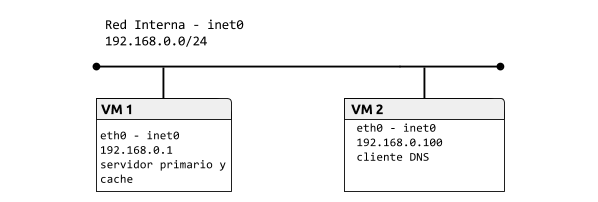

# Práctica 1.3.Domain Name System (DNS)

## Tabla de contenido
- [Topología](#topología).
- [Preparación del entorno para la práctica](#preparación-del-entorno-para-la-práctica).
- [Cliente DNS](#cliente-dns).
- [Servidor DNS](#servidor-dns).
- .

### Topología

### Preparación del entorno para la práctica

*VM1:*
<pre>
<code>$ip link set eth0 up
$ip a add 192.168.0.1/24 dev eth0
$ip route add default via 192.168.0.3
$ping -c 1 172.16.0.1
</code></pre>
*VM2:*
<pre>
<code>$ip link set eth0 up
$ip a add 192.168.0.2/24 dev eth0
$ip route add default via 192.168.0.3
</code></pre>

Cliente DNS

Servidor DNS
