# Práctica 1.3.Domain Name System (DNS)

## Tabla de contenido
- [Topología](#topología).
- [Dirección de enlace local](#dirección-de-enlace-local).
- [Dirección ULA](#dirección-ula).
- [Encaminamiento estático](#encaminamiento-estático).
- [Configuración Persistente](#configuración-persistente).
- [Autoconfiguración Anuncio de Prefijos](#autoconfiguración-anuncio-de-prefijos).
- [ICMP versión 6](#icmp-versión-6).

### Topología

### Dirección de enlace local

*********************** **Ejercicio 1** ***********************

*VM1:*
<pre>
<code>$ip link set eth0 up
</code></pre>

*VM2:*
<pre>
<code>$ip link set eth0 up
</code></pre>

Resultado(VM1):
<pre>
<code>fe80::a00:27ff:fef2:5a8f/64
</code></pre>

Resultado(VM2):
<pre>
<code>fe80::a00:27ff:feca:9ce8/64
</code></pre>

*********************** **Ejercicio 2** ***********************

*VM1:*
<pre>
<code>$ping6 fe80::a00:27ff:feca:9ce8 -I eth0
</code></pre>

*********************** **Ejercicio 3** ***********************

*VM1:*
<pre>
<code>$ping6 fe80::a00:27ff:feca:9ce8 -I eth0
</code></pre>

WhireShark:
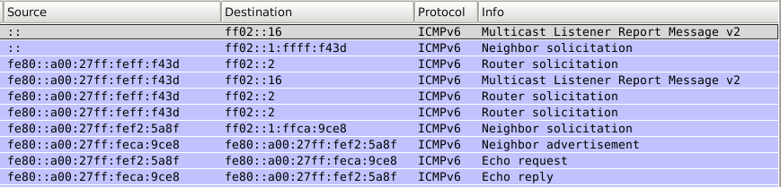

Podemos ver los siguientes datagramas:

**->Neighbor Solicitation:** Cuando se ha levantado la interfaz se ha enviado los datagramadas usados en el protocolo ode descubrimiento de vecinos. Se envían los datagramas desde la dirección :: que indica que la interfaz aún no tiene ninguna dirección asignada a la dirección multicas de enlace y a la dirección calculada en funciñon de la dirección unicast del nodo (FF02::1:FFXX:XXXX).

**->Router Solicitation:** Una vez asignada una dirección de enlace, se envían datagramanas a la dirección multicast para definir los routers.

**->Echo Request/Reply:** Los valores dentro del datagrama son:
-VER: 0110 (6)
-Trafic Class y Flow Lavel: 0
-Payload length: 64
-Next header: ICMPv6
-Hop limit: 64
-Source y Destination Address.

### Dirección ULA

*********************** **Ejercicio 1** ***********************

*VM1:*
<pre>
<code>$ip link set eth0 up
$ip a add fd00:0:0:a::1/64 dev eth0
</code></pre>

*VM2:*
<pre>
<code>$ip link set eth0 up
$ip a add fd00:0:0:a::2/64 dev eth0
</code></pre>

*********************** **Ejercicio 2** ***********************

*VM1:*
<pre>
<code>$ip link set eth0 up
$ping6 fd00:0:0:a::2 -I eth0
</code></pre>

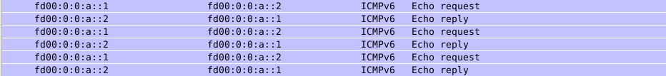

*********************** **Ejercicio 3** ***********************

*VM3:*
<pre>
<code>$ip link set eth0 up
$ip link set eth1 up
</code></pre>

*VM4:*
<pre>
<code>$ip link set eth0 up
</code></pre>

*VM1:*
<pre>
<code>$ping6 fe80::a00:27ff:feff:f43d  -I eth0
</code></pre>

*VM3:*
<pre>
<code>$ping6 fe80::a00:27ff:fee7:2755  -I eth1
</code></pre>

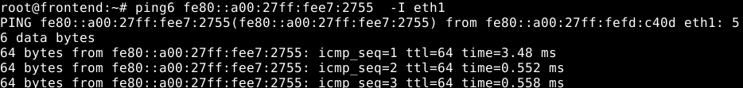

*********************** **Ejercicio 4** ***********************

*VM3:*
<pre>
<code>$ip a add fd00:0:0:a::3/64 dev eth0
$ip a add fd00:0:0:b::1/64 dev eth1
</code></pre>

*VM4:*
<pre>
<code>$ip a add fd00:0:0:b::2/64 dev eth0
</code></pre>

*********************** **Ejercicio 5** ***********************

*VM3:*
<pre>
<code>$ping6 fd00:0:0:a::1  -I eth0
</code></pre>

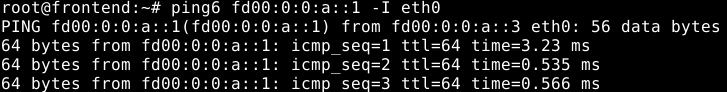

*VM3:*
<pre>
<code>$ping6 fd00:0:0:b::2  -I eth1
</code></pre>

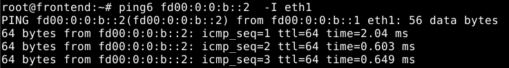

*VM1:*
<pre>
<code>$ping6 fd00:0:0:b::2  -I eth0
</code></pre>

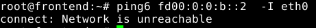

### Encaminamiento estático

*********************** **Ejercicio 1** ***********************

*VM1:*
<pre>
<code>$ip route -6
</code></pre>

*VM3:*
<pre>
<code>$ip route -6
</code></pre>

*********************** **Ejercicio 2** ***********************

*VM3:*
<pre>
<code>$sysctl -w net.ipv6.conf.all.forwarding=1.
</code></pre>

*********************** **Ejercicio 3** ***********************

*VM1 y VM2:*
<pre>
<code>$ip -6 route add fd00:0:0:b::/64 via fd00:0:0:a::3
</code></pre>

*VM4:*
<pre>
<code>$ip -6 route add fd00:0:0:a::/64 via fd00:0:0:b::1
</code></pre>

*VM1:*
<pre>
<code>$ping6 fd00:0:0:b::2  -I eth0
</code></pre>

*********************** **Ejercicio 4** ***********************

<pre>
<code>
Red fd00:0:0:a::/64 (VM1)
</code></pre>

<pre>
<code>
Red fd00:0:0:b::/64 (VM4)
</code></pre>

### Configuración Persistente

*********************** **Ejercicio 1** ***********************

*VM4:*
<pre>
<code>$nano /etc/network/interfaces/
********************************
iface eth0 inet6 static
   address fd00:0:0:a::f
   netmask 64

iface eth1 inet6 static
   address fd00:0:0:b::f
   netmask 64
********************************
</code></pre>

*********************** **Ejercicio 2** ***********************

*VM4:*
<pre>
<code>$ip link set eth0 down
$ip link set eth1 down
$ifup
$ifdown
</code></pre>

Resultado:
Se han configurado automáticamente las direccones ipv6.

### Autoconfiguración Anuncio de Prefijos

*********************** **Ejercicio 1** ***********************

*VM1:*
<pre>
<code>$ip a del fd00:0:0:a::1/64 dev eth0
$ip link set eth0 down
</code></pre>

*VM2:*
<pre>
<code>$ip a del fd00:0:0:a::2/64 dev eth0
$ip link set eth0 down
</code></pre>

*VM3:*
<pre>
<code>$ip a del fd00:0:0:a::3/64 dev eth0
$ip a del fd00:0:0:b::1/64 dev eth0
$ip link set eth0 down
$ip link set eth1 down
</code></pre>

*VM4:*
<pre>
<code>$ip a del fd00:0:0:b::2/64 dev eth0
$ip link set eth0 down
</code></pre>

*********************** **Ejercicio 2** ***********************

a)

*VM3:*
<pre>
<code>$nano /etc/quagga/daemons
********************************
zebra=yes
********************************
</code></pre>

b)

*VM3:*
<pre>
<code>$nano /etc/quagga/zebra.conf
********************************
interface eth0
  no ipv6 nd suppress-ra
  ipv6 nd prefix fd00:0:0:a::/64
  interface eth1
    no ipv6 nd suppress-ra
    ipv6 nd prefix fd00:0:0:b::/64
********************************
$service quagga start
</code></pre>

*********************** **Ejercicio 3** ***********************

*VM4:*
<pre>
<code>$ip link set eth0 up
$ip a
</code></pre>

Podemos observar cómo ha añadido una nueva dirección ipv6 a través de EUI-64 y la configuración añadida anteriormente.

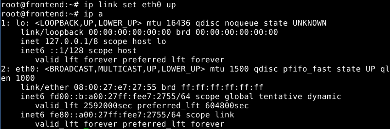

*********************** **Ejercicio 4** ***********************

a)

*VM2:*
<pre>
<code>$ip link set eth0 up
$ip a

****Se abre WhireShark****

</code></pre>

b)

*VM1:*
<pre>
<code>$ip link set eth0 up
$ip a
</code></pre>

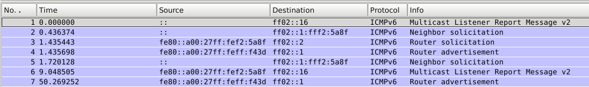

c)

**->Router Solicitation:** Una vez asignada una dirección de enlace, se envían datagramanas a la dirección multicast para definir los routers. En este caso va desde IP(VM1) hasta la dirección multicast de enlace (2). En la capa de transporte va desde MAC(VM1) a la dirección multias de IPv6 (33:33:00:00:00:02).

**->Router Advertisement:** En la capa de red va de MAC(VM3) a la dirección de multicast de Ipv6 (33:33:00:00:00:01) y en la capa de red va de IP(VM3) a la dirección multicast de enlace en la interfaz del host(1) .

*VM1:*
<pre>
<code>$ip ma
</code></pre>

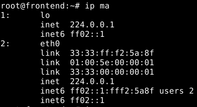

*********************** **Ejercicio 5** ***********************

*VM1:*
<pre>
<code>$ip a del fd00::a:a00:27ff:fef2:5a8f/64 dev eth0
$ip link set eth0 down
$sysctl -w net.ipv6.conf.eth0.use_tempaddr=2
$ip link set eth0 up
$ip a
</code></pre>

### ICMP versión 6

a)Solicitud y respuesta de eco.

*VM1:*
<pre>
<code>$
</code></pre>

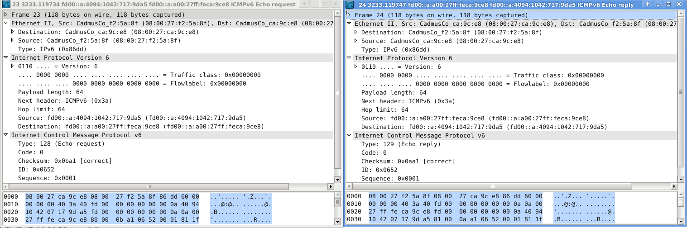

b)Solicitud y anuncio de encaminador.

c)Solicitud y anuncio de vecino.

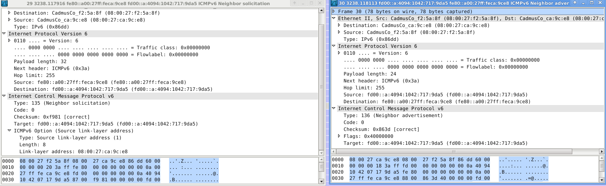

d)Destino inalcanzable - Sin ruta al destino (Code: 0).
*VM1:*
<pre>
<code>$ping6 fd00:0:0:b::ff:fe00:500 -I eth0
</code></pre>

