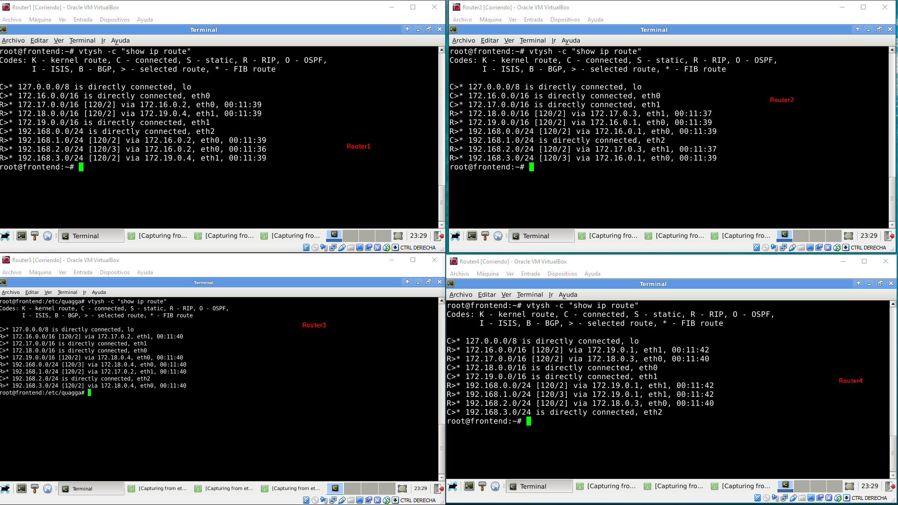
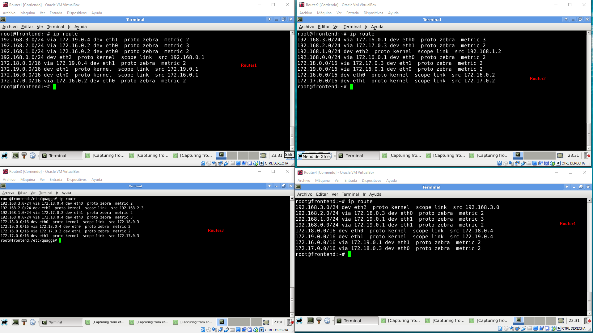
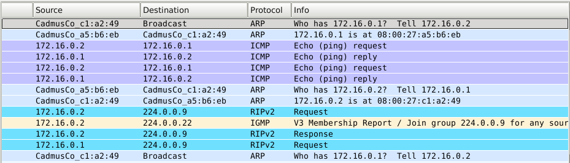
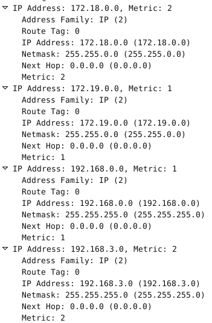
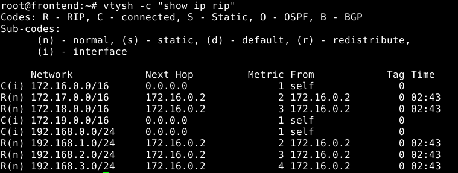

# Práctica 1.5.RIP y BGP
Parte I. Protocolo interior: RIP
Preparación del entorno
Configuración del protocolo RIP
Parte II. Protocolo exterior: BGP
Preparación del entorno
Configuración del protocolo BGP

## Tabla de contenido
- [Topología](#topología).
- [Parte I Protocolo interior RIP](#parte-i-protocolo-interior-rip).
  - [Preparación del entorno](#preparación-del-entorno).
  - [Configuración del protocolo RIP](#configuración-del-protocolo-rip).
- [Parte II Protocolo exterior BGP](#parte-ii-protocolo-exterior-bgp).
    - [Preparación del entorno](#preparación-del-entorno).
    - [Configuración del protocolo BGP](#configuración-del-protocolo-bgp).

### Topología

### Parte I Protocolo interior RIP

### Preparación del entorno

*ROUTER1:*
<pre>
<code>$ip link set eth0 up
$ip link set eth1 up
$ip link set eth2 up
$ip addr add 172.16.0.1/16 dev eth0
$ip addr add 172.19.0.1/16 dev eth1
$ip addr add 192.168.0.1/24 dev eth2
$sysctl -w net.ipv4.conf.all.forwarding=1
</code></pre>

*ROUTER2:*
<pre>
<code>$ip link set eth0 up
$ip link set eth1 up
$ip link set eth2 up
$ip addr add 172.16.0.2/16 dev eth0
$ip addr add 172.17.0.2/16 dev eth1
$ip addr add 192.168.1.2/24 dev eth2
$sysctl -w net.ipv4.conf.all.forwarding=1
</code></pre>

*ROUTER3:*
<pre>
<code>$ip link set eth0 up
$ip link set eth1 up
$ip link set eth2 up
$ip addr add 172.18.0.3/16 dev eth0
$ip addr add 172.17.0.3/16 dev eth1
$ip addr add 192.168.2.3/24 dev eth2
$sysctl -w net.ipv4.conf.all.forwarding=1
</code></pre>

*ROUTER4:*
<pre>
<code>$ip link set eth0 up
$ip link set eth1 up
$ip link set eth2 up
$ip addr add 172.18.0.4/16 dev eth0
$ip addr add 172.19.0.4/16 dev eth1
$ip addr add 192.168.3.0/24 dev eth2
$sysctl -w net.ipv4.conf.all.forwarding=1
</code></pre>

### Configuración del protocolo RIP

*********************** **Ejercicio 1** ***********************

*ROUTER2:*
<pre>
<code>ping -c 2 172.16.0.1
</code></pre>

*ROUTER4:*
<pre>
<code>ping -c 2 172.19.0.1
</code></pre>

Hacen ping correctamente.

*********************** **Ejercicio 2** ***********************

a)

*ROUTER1, ROUTER2, ROUTER3 y ROUTER4:*
<pre>
<code>$nano /etc/quagga/daemons
********************************
zebra=yes
ripd=yes
********************************
</code></pre>

b)

*ROUTER1, ROUTER2, ROUTER3 y ROUTER4:*
<pre>
<code>$nano /etc/quagga/ripd.conf
********************************
  # Activar el encaminamiento por RIP
  router rip
  # Definir la versión del protocolo que se usará
  version 2
  # Habilitar información de encaminamiento en redes asociadas a los interfaces
  network eth0
  network eth1
  network eth2
********************************
</code></pre>

c)

*ROUTER1, ROUTER2, ROUTER3 y ROUTER4:*
<pre>
<code>$touch /etc/quagga/zebra.conf
</code></pre>

d)

*ROUTER1, ROUTER2, ROUTER3 y ROUTER4:*
<pre>
<code>$sudo service quagga start
</code></pre>

*********************** **Ejercicio 3** ***********************

a)

*ROUTER1, ROUTER2, ROUTER3 y ROUTER4:*
<pre>
<code>$vtysh -c "show ip rip"
</code></pre>

Para el **Router 1** podemos observar que las redes 172.16.0.0/16, 172.19.0.0/16 y 192.168.0.0/24 no necesita definir el Next Hop porque está conectadas a ellas mientras que:

-Para conectar a la red 172.17.0.0/16 que es la que está conectada entre el Router 2 y el Router 3 necesita ir por el Router 2: 172.16.0.2.
-Para conectar a la red 172.18.0.0/16 que es la que está conectada entre el Router 3 y el Router 4 necesita ir por el Router 4: 172.19.0.4.
-Para conectar a la red 192.168.1.0/24 que es la que está conectada en el Router 2 necesita ir por el Router 2: 172.16.0.2.
-Para conectar a la red 192.168.2.0/24 que es la que está conectada en el Router 3 necesita ir por el Router 2: 172.16.0.2.
-Para conectar a la red 192.168.3.0/24 que es la que está conectada en el Router 4 necesita ir por el Router 4: 172.19.0.4.

b)

*ROUTER1, ROUTER2, ROUTER3 y ROUTER4:*
<pre>
<code>$vtysh -c "show ip route"
</code></pre>

Con este comando podemos ver lo comentado anteriormente aunque también nos da la información de la interfaz necesaria para realizar dichas conexiones.

c)

*ROUTER1, ROUTER2, ROUTER3 y ROUTER4:*
<pre>
<code>$ip route
</code></pre>

Con este comando, al igual que con el primero, también podemos observar la métrica definida, en este caso, el número de saltos hasta llegar a dicha red.

*********************** **Ejercicio 4** ***********************

Aquí podemos ver algunos de los paquetes intercambiados para la interfaz eth0 de la ip 172.16.0.1:

**->1er Request:**
-Encapsulado: RIPv2
-Direcciónes Origen: Router 1 (172.16.0.1)
-Dirección Destino: Multicast (224.0.0.9)
-Campo de versión: V2
-Información para cada ruta: Sin especificar, sirve para que reciba un IGMP para poder unirse al grupo de esa dirección multicast.
**->Response:**
-Encapsulado: RIPv2
-Direcciónes Origen: Router 1 (172.16.0.1)
-Dirección Destino: Multicast (224.0.0.9)
-Campo de versión: V2
-Información para cada ruta:

*********************** **Ejercicio 5** ***********************

*ROUTER4:*
<pre>
<code>$ip link set eth1 down
</code></pre>

Podemos observar que ya no recibe anuncios del Router 4 (172.19.0.4):

Y ya no aparece en la tabla de rutas:

*********************** **Ejercicio 6** ***********************

a)

*ROUTER1, ROUTER2, ROUTER3 y ROUTER4:*
<pre>
<code>$nano /etc/quagga/ripd.conf
********************************
  password redes
  no router rip
********************************
sudo service quagga restart
</code></pre>

b)

<pre>
<code>$telnet localhost ripd
Trying 127.0.0.1...
Connected to localhost.
Escape character is '^]'.

Hello, this is Quagga (version 0.99.20.1).
Copyright 1996-2005 Kunihiro Ishiguro, et al.

User Access Verification

Password:
frontend> enable
frontend# configure terminal
frontend(config)# router rip
frontend(config-router)# version 2
frontend(config-router)# network eth0
frontend(config-router)# write
Configuration saved to /etc/quagga/ripd.conf
frontend(config-router)# exit
frontend(config)# exit
frontend# show running-config

Current configuration:
!
password redes
!
router rip
 version 2
 network eth0
!
line vty
!
end
frontend# write
Configuration saved to /etc/quagga/ripd.conf
</pre></code>

### Parte II Protocolo exterior BGP

### Preparación del entorno

*ROUTER1, ROUTER2, y ROUTER3:*
<pre>
<code>$sudo service quagga stop
</code></pre>

*ROUTER1:*
<pre>
<code>$ip link set eth0 up
$ip addr add 2001:db8:200:1::1/64 dev eth0
</code></pre>

*ROUTER2:*
<pre>
<code>$ip link set eth0 up
$ip link set eth1 up
$ip addr add 2001:db8:200:1::2/64 dev eth0
$ip addr add 2001:db8:200:2::2/64 dev eth1
</code></pre>

*ROUTER3:*
<pre>
<code>$ip link set eth0 up
$ip addr add 2001:db8:200:2::3/64 dev eth0
</code></pre>

### Configuración del protocolo BGP
