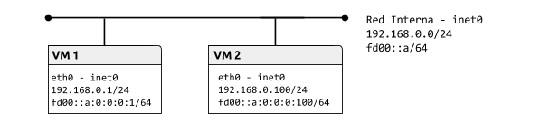

# Práctica 2.4.Tuberías

## Tabla de contenido
- [Topología](#topología).
- [Preparación del entorno para la práctica](#preparación-del-entorno-para-la-práctica).
- [Llamadas del API para la gestión de direcciones](#llamadas-del-api-para-la-gestión-de-direcciones).
- [Protocolo UDP Servidor de hora](#protocolo-ucp-servidor-de-hora).
- [Protocolo TCP Servidor de echo](#protocolo-tcp-servidor-de-echo).

### Topología

## Preparación del entorno para la práctica

(No es neccesario para el primer apartado).

*VM1*
<pre>
<code>$ip link set eth0 up
$ip a add 192.168.0.1/24 dev eth0
$ip a add fd00::a:0:0:0:1/64 dev eth0
</code></pre>

*VM2*
<pre>
<code>$ip link set eth0 up
$ip a add 192.168.0.100/24 dev eth0
$ip a add fd00::a:0:0:0:100/64 dev eth0
</code></pre>

## Llamadas del API para la gestión de direcciones

*********************** **Ejercicio 1** ***********************

[ej1](Llamadas_del_api_para_la_gestion_de_direcciones/ej1.c)

## Protocolo UDP Servidor de hora

*********************** **Ejercicio 1** ***********************

[ej1](Protocolo_UDP_Servidor_de_hora/ej1.c)

*********************** **Ejercicio 2** ***********************

[ej2](Protocolo_UDP_Servidor_de_hora/ej2.c)

*********************** **Ejercicio 3** ***********************

[ej3](Protocolo_UDP_Servidor_de_hora/ej3.c)

*********************** **Ejercicio 4** ***********************

[ej4](Protocolo_UDP_Servidor_de_hora/ej4.c)

## Protocolo TCP Servidor de echo

*********************** **Ejercicio 1** ***********************

[ej1](Protocolo_TCP_Servidor_de_echo/ej1.c)

*********************** **Ejercicio 2** ***********************

[ej2](Protocolo_TCP_Servidor_de_echo/ej2.c)

*********************** **Ejercicio 3** ***********************

[ej3](Protocolo_TCP_Servidor_de_echo/ej3.c)

*********************** **Ejercicio4** ***********************

[ej4](Protocolo_TCP_Servidor_de_echo/ej4.c)
